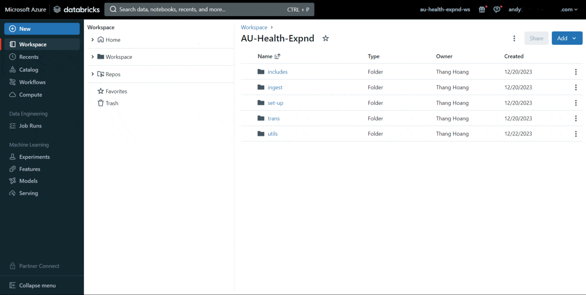
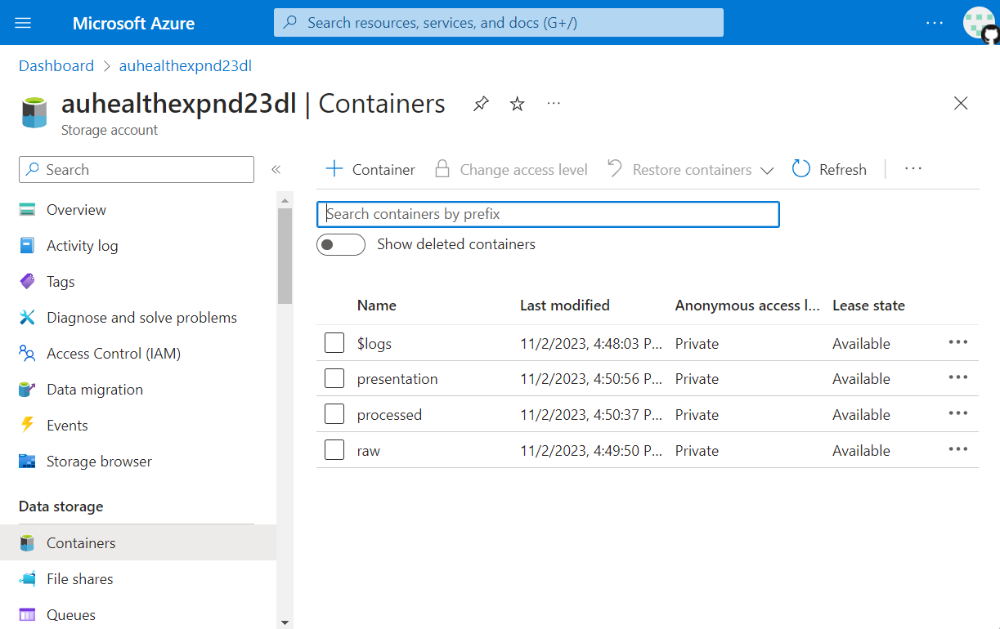
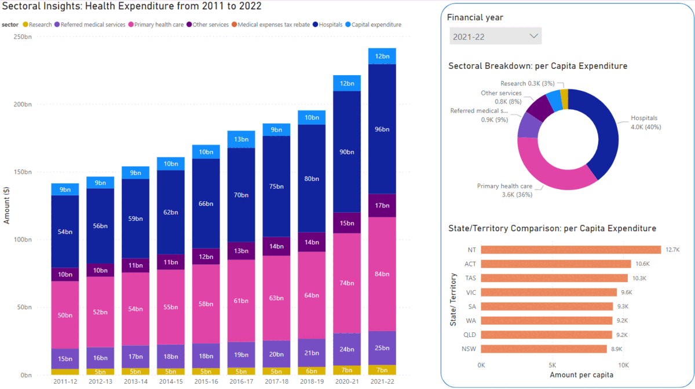

# Australia Health Expenditure Azure Data Engineering Project

This project demonstrates an end-to-end Azure ETL Data Engineering solution for analysing Australia's Health Expenditure. The project utilises various Azure services, including Azure Data Factory, DataBricks, Data Lake, Key Vault, and Power BI.

## Project Overview

The goal of this ETL project is to showcase how to ingest, process, and analyse Australia's Health Expenditure data using Azure services. The ETL flow involves extracting data, transforming it using DataBricks, storing it in Data Lake, and creating visualizations in Power BI.

## Power BI report

You can view the [Power BI report here](https://app.powerbi.com/view?r=eyJrIjoiMWQwYTQxMmEtMjk2Ni00ZGZmLWJlOTgtOTJkOGUwZDI4ZjMyIiwidCI6IjhiMTc3ZWEzLWQzN2MtNDMyNS05NjQyLTQ1MDNlZmMxYzY1NCJ9).

## Data Collection

Data source is from [Australian Institute of Health and Welfare](https://www.aihw.gov.au/reports/health-welfare-expenditure/health-expenditure-australia-2021-22/data).

## Services Used

- **Azure Data Factory:** Orchestrates and automates ETL workflows, including data extraction. Extracts https data source, and orchestrate ETL workflows.

Extract-Copy activity

Orchestrate pipelines

- **DataBricks:** Performs advanced data transformations on the extracted data, using Python and SQL.

Ingest

Transform

- **Data Lake:** Serves as the storage repository for raw, processed and presentation data.

- **Azure AD:** Manage secured access.

- **Key Vault:** Safely stores and manages secrets used in ETL operations, ensuring secure access to resources.

- **Power BI:** Creates insightful visualisations for data analysis and reporting.

## Project Structure

The project is organised as follows:

- **/data-factory:** Contains Azure Data Factory pipeline configurations.

- **/databricks-notebooks:** Includes DataBricks notebooks in PySpark and SparkSQL for data processing.

- **/raw-data:** Store the source data in csv files.

- **/screenshots-charts:** Captures visual documentation and screenshots.

- **/powerBI:** Holds Power BI report files.

## Conclusion
This project serves as a demonstration of building an end-to-end Extract, Transform, Load (ETL) cloud solution using Microsoft Azure. Key considerations:

- **Dataset Selection:** To optimise costs for demonstration purposes, a small dataset has been chosen. This aims to manage compute and storage expenses efficiently while still showcasing the core functionality of the ETL process.

- **Parameterized Data Extraction:** Data extraction is facilitated through the utilisation of a JSON configuration file. By passing of parameters to the Azure Data Factory pipeline, the project emphasises automation and scalability, paving the way for future expansions.

- **Processing with Databricks:** Databricks has been selected for this demo, showcasing one of many processing choices. Alternatives like Azure Data Factory data flows and custom Python scripts offer flexibility, enabling users to pick the best-fit processing engine for their needs.

- **Future Enhancements:** Upcoming projects will include Incremental loading and CICD.
